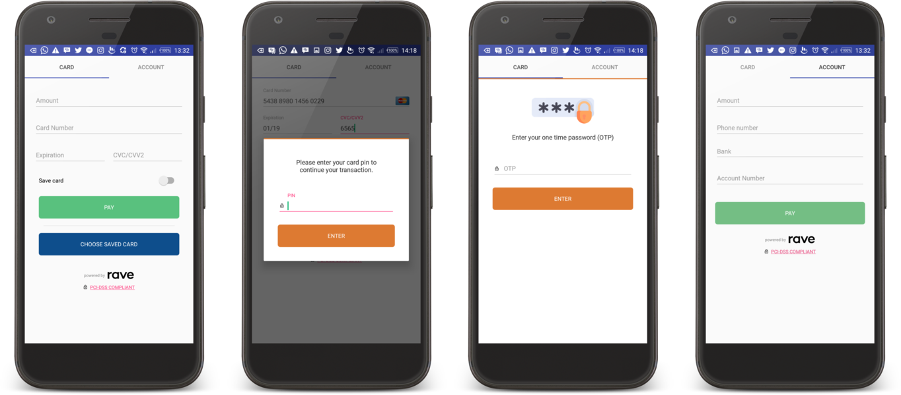
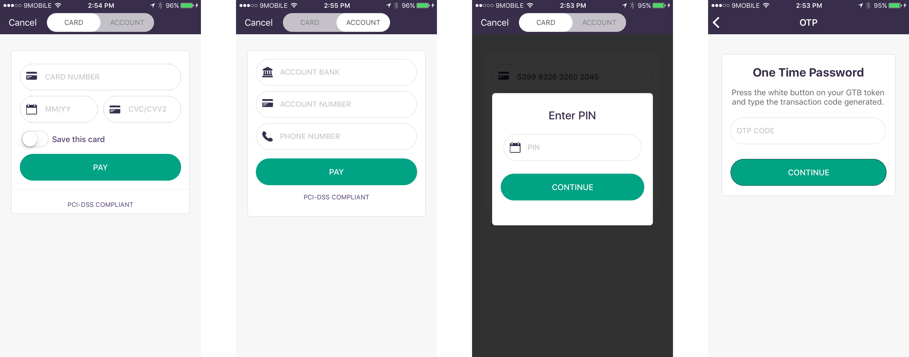

# Flutter Ravepay

[](https://pub.dartlang.org/packages/flutter_ravepay)

Flutter_Ravepay provides a wrapper that incorporate payments using [Ravepay](https://rave.flutterwave.com/) within your flutter applications. The integration is achieved using Ravepay's [Android](https://flutterwavedevelopers.readme.io/docs/android)/[iOS](https://flutterwavedevelopers.readme.io/docs/ios) SDK libraries. It currently has full support for only Android. Getting it to work on iOS comes with a few more steps and configurations (soon to come).

<div style="text-align: center">
    <table>
        <tr>
            <td style="text-align: center">
                
            </td>
        </tr>
        <tr>
            <td style="text-align: center">
                
            </td>
        </tr>
    </table>
</div>

## Installing

```yaml
dependencies:
  flutter_ravepay: "^0.2.0"
```

### Import

```dart
import 'package:flutter_ravepay/flutter_ravepay.dart';
```

### Instantiate

```dart
Ravepay ravePay = Ravepay.of(context);
```

### Charging a Card

```dart
RavepayResult result = await ravePay.chargeCard(
    const RavepayConfig(
        amount: 4500.0,
        country: "NG",
        currency: "NGN",
        email: "testemail@gmail.com",
        firstname: "Jeremiah",
        lastname: "Ogbomo",
        narration: "Test Payment",
        publicKey: "****",
        secretKey: "****",
        txRef: "ravePay-1234345",
        useAccounts: false,
        useCards: true,
        isStaging: true,
        useSave: true,
        metadata: [
          const RavepayMeta("email", "jeremiahogbomo@gmail.com"),
          const RavepayMeta("id", "1994"),
        ]
    ),
);
```

## Bugs/Requests

If you encounter any problems feel free to open an issue. If you feel the library is
missing a feature, please raise a ticket on Github and I'll look into it.
Pull request are also welcome.

## Note

For help getting started with Flutter, view our online
[documentation](https://flutter.io/).

For help on editing plugin code, view the [documentation](https://flutter.io/platform-plugins/#edit-code).

## License

MIT License
